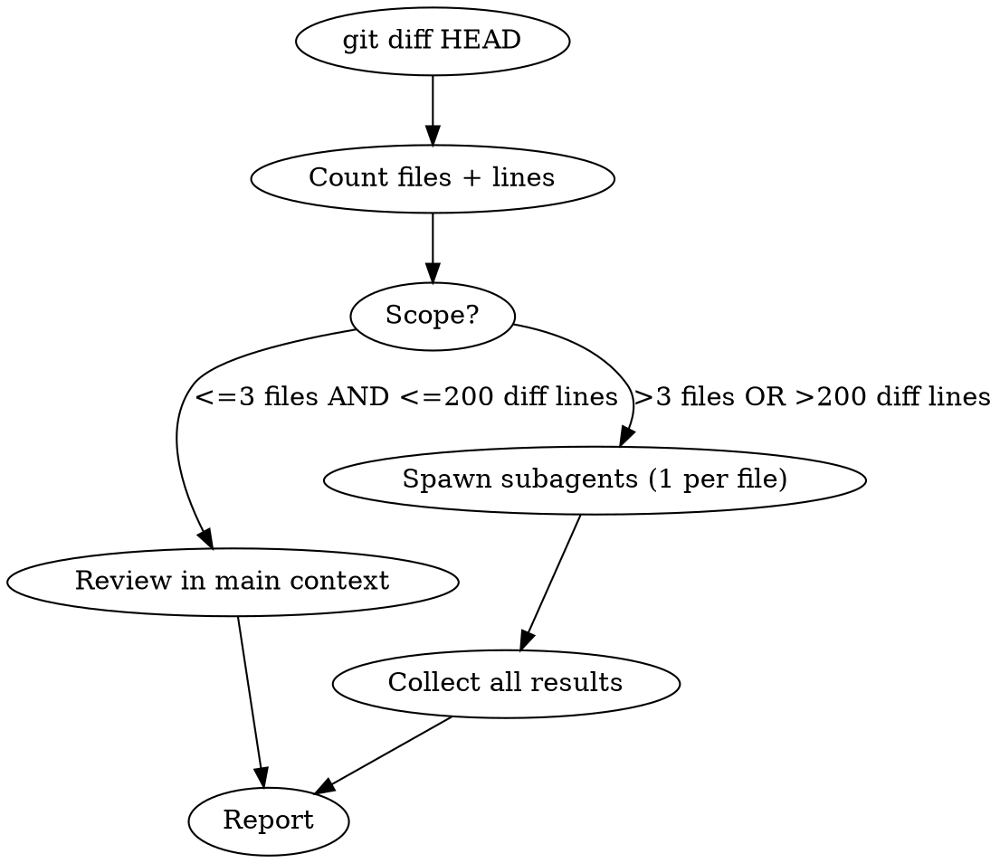

# PI Check

Review all git changes for anything you wouldn't want in a public-facing repo, using LLM semantic judgment. **NEVER use keyword matching, regex, grep, or pattern searches** — they cannot distinguish real PI from code constructs.

## What counts as PI

Anything that could identify, locate, or authenticate a specific person or system. Examples (non-exhaustive):

- Real names of actual people (not variable names or fictional test data)
- Email addresses, phone numbers, physical/mailing addresses
- Government IDs (SSN, passport, driver's license, tax ID)
- Financial data (credit card numbers, bank accounts)
- API keys, tokens, passwords, private keys, connection strings, secrets of any kind
- Internal URLs, hostnames, or IP addresses that reveal infrastructure
- Health/medical data, biometric data
- Location data tied to individuals (GPS coords, home addresses)
- Dates of birth, age combined with other identifiers
- Device/network identifiers tied to specific users
- User activity logs with identifying information
- Proprietary data, internal project codenames, or confidential business info
- Anything else that a reasonable person would not want exposed publicly

This is a judgment call, not a checklist. When in doubt, flag it as REVIEW.

## Process



### 1. Get the changes

```bash
git diff HEAD          # staged + unstaged changes vs last commit
git diff HEAD --stat   # summary to assess scope
git ls-files --others --exclude-standard  # untracked files (not in any diff!)
```

**Untracked files won't appear in `git diff HEAD`.** Read each untracked file directly and include it in the review. This is easy to miss and is where new secrets-laden config files hide.

### 2. Assess scope and dispatch

| Condition | Action |
|-----------|--------|
| ≤3 files AND ≤200 diff lines | Read full diff, review directly |
| >3 files OR >200 diff lines | Spawn one `general-purpose` subagent per changed file, run in parallel |

**Subagent prompt template** (adapt per file):

> Review this git diff for personal information — anything you wouldn't want in a public-facing repo. Use semantic judgment ONLY — no keyword/regex matching.
>
> Diff for `{filepath}`:
> ```
> {file_diff}
> ```
>
> For EVERY change (added AND removed lines), assess whether it contains or reveals PI. This includes but is not limited to: real names, contact info, government IDs, financial data, API keys/tokens/passwords/secrets, internal URLs/hostnames, health data, location data tied to individuals, proprietary/confidential information, or anything else a reasonable person would not want exposed publicly.
>
> For each finding, report: line number, the content, category, and severity (BLOCK or REVIEW).
> BLOCK = definitely PI, must remove. REVIEW = possibly PI, needs human judgment.
> If nothing found, report CLEAN.

### 3. Report

Consolidate results into a summary:

| Severity | Meaning |
|----------|---------|
| **BLOCK** | Confirmed PI — must be removed before committing |
| **REVIEW** | Possible PI — needs human judgment |
| **CLEAN** | No PI detected |

List each finding with file path, line number, content, and category.

## What NOT to do

- **Never grep/regex/keyword search for PI.** A name like "Jordan" in a comment about a real colleague is PI. A variable `jordan_score` is not. Only LLM judgment can tell the difference.
- **Never skip removed lines.** Deleted code reveals what data the system handles.
- **Never skip comments, TODOs, or docstrings.** These are common PI hiding spots ("TODO: ask john.smith@company.com about this").
- **Never skip config/env files.** The #1 source of leaked credentials.
- **Never assume test data is safe.** If test fixtures contain real-looking PI derived from real sources, it's still PI.
